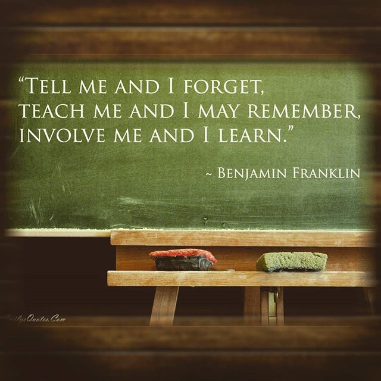

## Pedagogy

{fig-align="center"}

## Capstone Project

Utilize various skills learned during the bootcamp to solve problems that needs AI.

Tentative schedule:

1. Ideation and team formation (by end of week 4)
2. Proposal, project plan, and approval (week 5)
3. Phase 1 (end of week 6): progress presentation
4. Phase 2 (end of week 7): progress presentation
5. Final submission and evaluation (week 8)

## Learning Material

1. **🧬 Slides**: concepts, mental models, connecting ideas, and discussion.
2. **🔬 Labs**: details, docs, debugging, and what-ifs.
3. **✍️ Daily Exercises**: guided through step-by-step questions.
4. **🎯 Weekly Projects**: goal to achieve using learned skills.
5. **📝 Quiz**: knowledge test.
6. **💬 Presentation**: express ability to communicate technically.

## Why Presentations?

- Your success in life depends on three key elements:
    1. Your ability to **speak**
    2. Your ability to **write**
    3. The **quality of your ideas**
- .. in that order (as [Professor Winston puts it](https://www.youtube.com/watch?v=Unzc731iCUY)).
- Your ability to communicate ideas is ultimately more critical to your success than the ideas themselves.

## One-to-one check-ins

Random selection:

1. Show and explain your solutions to specific exercises
2. Questions about the learning material covered so far

## ❌️ Bad

1. Let AI do the work
2. Low attendance, come late, leave early
3. No clue what work to be done today, tomorrow, and end of week.

## ✅️ Good

1. You are honest and consistent in putting in the required effort in class
2. You pay attention to instructions and ask when things aren't clear
3. You ask the right questions; for the sake of learning
4. You are not afraid of making mistakes; for the sake of exceeding your limits

# The End