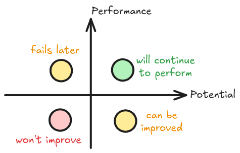

## Problem Framing

**Problem framing** is the process of analyzing a problem to isolate the individual elements that need to be addressed to solve it.

Problem framing helps determine your project's technical feasibility and provides a clear set of goals and success criteria. When considering an ML solution, effective problem framing can determine whether or not your product ultimately succeeds.

At a high level, ML problem framing consists of two distinct steps:

1. Determining whether ML is the right approach for solving a problem.
2. Framing the problem in ML terms.

## State the goal

- Begin by stating your goal in non-ML terms.
- The goal is the answer to the question, "What am I trying to accomplish?"

The following tables help you map specific **applications + goals** to **ML Task** ..

## Supervised ML

|**Application**|**Goal**|**ML Task**|**Description**|
|---|---|---|---|
|Navigation|ETA prediction|Regression|Calculate the estimated time of arrival for a specific route.|
|Weather|Rainfall forecast|Regression|Predict the expected rainfall volume for a given area.|
|Revenue|Sales forecasting|Regression|Calculate the expected sales revenue for a future period.|
|Drug Response|Estimate efficacy|Regression, Classification|Evaluate the potential effectiveness of a medical treatment.|
|Manufacturing|Predict component failure|Regression|Estimate the remaining time before a specific machine component fails.|
|E-commerce|Ad click likelihood|Classification|Determine the likelihood that a customer will click on a specific advertisement.|
|Healthcare|Readmission risk|Classification|Assess the probability of a patient returning to the hospital.|
|Cybersecurity|Attack detection|Classification|Identify whether network activity constitutes a malicious attack.|
|Real Estate|Home valuation|Regression|Estimate the market value of a specific residential property.|
|Email|Spam filtering|Classification|Categorize incoming messages as legitimate or unsolicited spam.|
|HR|Attrition risk|Classification|Determine the probability that an employee will leave the company.|
|Finance|Fraud classification|Classification|Identify whether a specific financial transaction is fraudulent.|

## Unsupervised ML

|**Application**|**Goal**|**ML Task**|**Description**|
|---|---|---|---|
|Fraud|Detect anomalies|Isolation Forest, GMM|Identify unusual data patterns indicating potential fraud.|
|Segmentation|Group customers|k-means, DBSCAN|Group customers based on shared behaviors or traits.|
|Visualization|Simplify data|Dimensionality Reduction|Reduce dataset complexity for easier visual analysis.|
|Experiment Outcomes|Pattern discovery|Clustering|Uncover hidden structures within experimental data.|
|Efficiency|Streamline features|Dimensionality Reduction|Remove redundant variables to improve model performance.|

## Deep Learning

|**Application**|**Goal**|**ML Task**|**Description**|
|---|---|---|---|
|Product Class|Image classification|Computer Vision|Categorize items automatically based on visual features.|
Tumor Detection|Map brain tumors|Computer Vision|Identify and locate abnormal tissue in medical scans.|
Text/News|Content flagging|NLP|Detect inappropriate or specific themes within text.|
Summarization|Condense text|NLP|Generate concise overviews of lengthy documents.|
Chatbots|Conversational AI|NLP|Automate human-like dialogue for user interactions.|
Voice|Audio processing|NLP|Convert spoken language into actionable text.|

## Clear use case for ML (1/2)

> "To a man with a hammer, everything looks like a nail"

- You don't want to implement a complex ML solution when a simpler non-ML solution will work.
    - Try solving the problem manually using a *Heuristic*
    - Verify that your current non-ML solution is optimized

::: {.notes}
- Some view ML as a universal tool that can be applied to all problems. In reality, ML is a specialized tool suitable only for particular problems.
- A heuristic is a hunch, naive baseline or simple intuitive solution.
- For example, "With a heuristic, we achieved 86% accuracy. When we switched to a deep neural network, accuracy went up to 98%."
:::

## Clear use case for ML (2/2)

- **Difference**: How much better do you think an ML solution can be?
- **Cost**: How expensive is the ML solution in both the short- and long-term?
    - In some cases, it costs significantly more in terms of compute resources and time to implement ML
    - Note that small improvements can be justified in large systems.
- **Maintenance**: How much maintenance will the solution require?
    - In many cases, ML implementations need dedicated long-term maintenance.
- **Expertise**: Does your product have the resources to support training or hiring people with ML expertise?

## The ART of Data

- **Available**.  
    - Make sure all inputs are available at prediction time in the correct format.
    - If it will be difficult to obtain certain feature values at prediction time, omit those features from your datasets.
- **Representative**.  
    - datasets should accurately reflect the events, user behaviors, and/or the phenomena of the real world being modeled.
    - Training on unrepresentative datasets can cause poor performance when the model is asked to make real-world predictions.
- **Trusted**. Understand where your data will come from.
    - Will the data be from trusted sources you control, like logs from your product
    - or will it be from sources you don't have much insight into, like the output from another ML system?

## Data Quantity and Quality

- **An Order of Magnitude**:  
    As a starting point, your dataset should ideally have at least $10$ times (or $100$ times) more examples than the number of parameters in your model.
- **Simple Models, Large Data**:  
    Google's success with simple models on massive datasets highlights the power of data quantity.
- **Simple Tasks, Small Data**:  
    For relatively straightforward problems, a small dataset might suffice. Complex tasks often require big data.
- **Quality Over Quantity**:  
    While a large dataset is beneficial, the quality of features is equally important.

## Feature Engineering (1/2)

Engineering features include selection, creation and transformation of data. Here are they key techniques that it includes:

1. **Create new variables**
    - `age` from `date_of_birth`
    - `BMI` from `weight` and `height`
    - `season` from `date` and `city`
2. **Discretize continuous variables**
    - `age_group` (e.g., 0-18, 19-35, 36-55, 56+) from `age`
    - `weight_category` (e.g., <50kg, 50-80kg, >80kg) from `weight`
    - `socioeconomic_class` (e.g., Low, Middle, High) from `income`
3. **Data Enrichment**
    - Appending `neighborhood_median_income` based on `zip_code`
    - Adding `historical_weather` (e.g., "rainfall", "temp") based on `date` and `location`

## Feature Engineering (2/2)

4. **Data Aggregation**
    - `monthly_total_spend` derived from daily transaction logs
    - `average_session_duration` grouped by `user_id` from raw click events
5. **Handling Date-Time Variables**:
    - Feature Extraction: Extract relevant information from date-time variables, such as: `year`, `month`, `day`, `hour`, and time intervals.
    - Time-Based Features: Create features like:
        1. `time_since_last_purchase` or    
        2. `time_since_login`.

## Predictive power

Some features will have more predictive power than others:

- For example, in a weather dataset, features such as `cloud_coverage`, `temperature`, and `dew_point` would be better predictors of rain than `moon_phase` or `day_of_week`. 
- For the video app example, you could hypothesize that features such as `video_description`, `length` and `views` might be good predictors for which videos a user would want to watch.

You can automate finding a feature's predictive power by using algorithms such as [Pearson correlation](https://wikipedia.org/wiki/Pearson_correlation_coefficient), [Adjusted mutual information (AMI)](https://wikipedia.org/wiki/Adjusted_mutual_information), and [Shapley value](https://wikipedia.org/wiki/Shapley_value#In_machine_learning), which provide a numerical assessment for analyzing the predictive power of a feature.

## From prediction to decision

There's no value in predicting something if you can't turn the prediction into an action that helps users.

For example:

- A model that predicts whether it will rain should feed into a weather app.
- A model that predicts the estimated time of arrival should feed into the customer app.

## Classification

A **classification model** predicts what category the input data belongs to, for example, whether an input should be classified as A, B, or C.

{fig-align="center" .r-stretch}

**Figure 1.** A classification model making predictions.

## from classification to decision

Based on the model's prediction, your app might make a decision. For example, if the prediction is category A, then do X; if the prediction is category B, then do, Y; if the prediction is category C, then do Z. In some cases, the prediction _is_ the app's output.

{fig-align="center" .r-stretch}

**Figure 2.** A classification model's output being used in the product code to make a decision.

## Regression

A **regression model** predicts a numerical value.

{fig-align="center" .r-stretch}

**Figure 3.** A regression model making a numeric prediction.

## from regression to decision

Based on the model's prediction, your app might make a decision. For example:

- if the prediction falls within range A, do X;
- if the prediction falls within range B, do Y;
- if the prediction falls within range C, do Z.
- In some cases, the prediction _is_ the app's output.

{fig-align="center" .r-stretch}

**Figure 4.** A regression model's output being used in the product code to make a decision.

## Regression vs. Classification: The Threshold Problem (1/2)

Consider the following scenario:

You want to [cache](https://wikipedia.org/wiki/Cache_\(computing\)) videos based on their predicted popularity. In other words, if your model predicts that a video will be popular, you want to quickly serve it to users. To do so, you'll use the more effective and expensive cache. For other videos, you'll use a different cache. Your caching criteria is the following:

- If a video is predicted to get `50` or more views, you'll use the expensive cache.
- If a video is predicted to get between `30` and `50` views, you'll use the cheap cache.
- If the video is predicted to get less than `30` views, you won't cache the video.

## Regression vs. Classification: The Threshold Problem (2/2)

- **The Scenario:** Predicting a numeric value (e.g., video views).
- **The Regression Blindspot:** Loss functions are symmetric and ignore business rules.
    - *Example:* If actual `views = 30`, predictions of `28` and `32` produce the *exact same loss*.
- **The Pivot:** Regression models do not understand product-defined cutoffs.
- **The Solution:** If app behavior changes drastically at a specific threshold, reframe the task as a **Classification** problem.

{fig-align="center" .r-stretch}

**Figure 5.** Training a regression model.

::: {.notes}
Regression models only see mathematical distance. If a video gets 30 views, being off by 2 (predicting 28 or 32) is penalized equally. However, your product might have a hard trigger that activates at exactly 30 views. Because regression is blind to this threshold, a minor numerical error can cause the wrong product behavior. If your app relies on a hard cutoff, don't predict the exact number. Instead, classify the outcome: "Will it cross the 30-view threshold? Yes or No?"
:::

## Define the success metrics

Success metrics differ from the model's evaluation metrics, like **accuracy**, **precision**, **recall**, or **AUC**.

For example, the weather app's success and failure metrics might be defined as the following:

|||
| ----------- | -------------------------------------------------------- |
| **Success**| Users open the "Will it rain?" feature 50 percent more often than they did before. |
| **Failure**| Users open the "Will it rain?" feature no more often than before. |

The video app metrics might be defined as the following:

|||
| ----------- | -------------------------------------------------------- |
| **Success** | Users spend on average 20 percent more time on the site. |
| **Failure** | Users spend on average no more time on site than before. |

Both cases are possible:

- Case 1: high metric but fails criteria; **Bad**.
- Case 2: low metric but meets success criteria; **Good**.

## Good now vs can be good later

Models may not meet success criteria today, but if they have potential of improvement, we can continue working on them.

{fig-align="center" .r-stretch}

## References

- https://developers.google.com/machine-learning/problem-framing